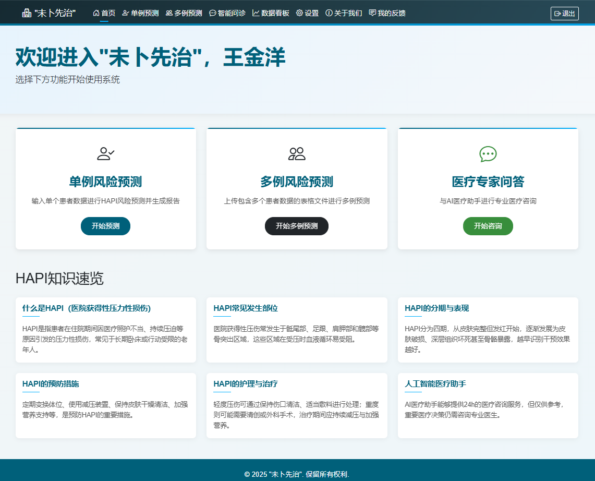
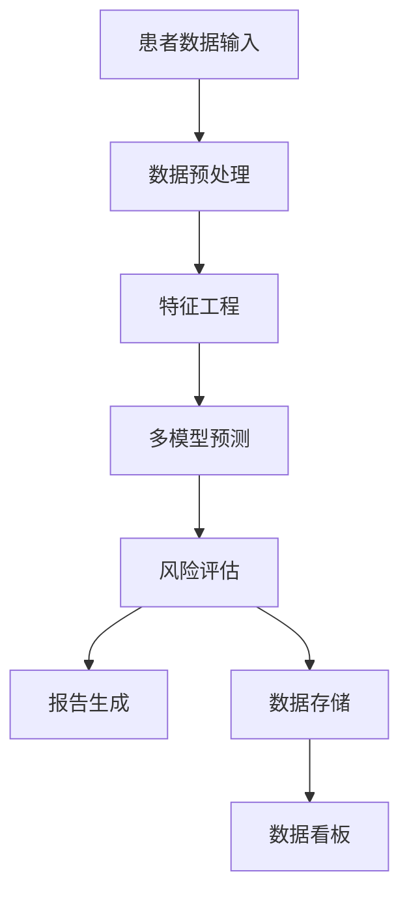

# 🏥 未卜先“治”——老年患者HAPI风险预测及AI医疗问诊系统


基于机器学习的医院获得性压力性损伤（Hospital Acquired Pressure Injury, HAPI）预测系统。


## 📑 目录

- [项目概述](#-项目概述)
- [系统特色](#-系统特色)
- [主要功能](#-主要功能)
- [快速开始](#-快速开始)
- [使用指南](#-使用指南)
- [技术架构](#-技术架构)
- [项目结构](#-项目结构)
- [API 文档](#-api-文档)
- [部署指南](#-部署指南)
- [常见问题](#-常见问题)
- [贡献指南](#-贡献指南)
- [版本历史](#-版本历史)
- [联系方式](#-联系方式)
- [许可证](#-许可证)

## 🔍 项目概述

HAPI 预测系统是一个基于机器学习的医疗预测工具，旨在帮助医疗机构预测和预防医院获得性压力性损伤。系统通过分析患者的各项临床指标，使用多种机器学习模型进行预测，并提供详细的风险评估报告。该系统适用于医疗工作者快速评估老年患者HAPI风险，及早采取预防措施。



## ✨ 系统特色

1. **🔄 多模型集成**：结合多种机器学习模型的预测结果，提高预测准确性
2. **📊 详细报告生成**：自动生成包含风险因素分析的PDF报告
3. **📈 批量处理能力**：支持批量预测与结果导出，适合大规模筛查
4. **📉 可视化数据看板**：直观展示预测统计与趋势
5. **🤖 智能医疗问答**：提供医疗知识咨询功能，辅助专业决策
6. **🌙 人性化设计**：支持主题切换、辅助功能与语音交互

## 🚀 主要功能

### 1. 预测功能
- **单例预测**：预测单个患者的 HAPI 风险，提供风险等级评估和详细报告
- **批量预测**：上传CSV或Excel文件批量预测多个患者的 HAPI 风险，生成综合结果
- **多模型支持**：
  - XGBoost
  - 随机森林
  - 逻辑回归
  - 朴素贝叶斯

### 2. 输入特征

<table>
  <tr>
    <th>数值型特征</th>
    <th>分类型特征</th>
  </tr>
  <tr>
    <td>
      <ul>
        <li>住院第几天</li>
        <li>白细胞计数</li>
        <li>血钾浓度</li>
        <li>白蛋白计数</li>
      </ul>
    </td>
    <td>
      <ul>
        <li>吸烟史</li>
        <li>摩擦力/剪切力</li>
        <li>移动能力</li>
        <li>感知觉</li>
        <li>身体活动度</li>
        <li>日常食物获取</li>
        <li>水肿</li>
        <li>皮肤潮湿</li>
        <li>意识障碍</li>
        <li>高血压</li>
        <li>糖尿病</li>
        <li>冠心病</li>
        <li>下肢深静脉血栓</li>
      </ul>
    </td>
  </tr>
</table>

### 3. 预测结果与报告
- 预测结果（是否会发生 HAPI）
- 风险等级评估（低、中、高）
- 预测概率
- 特征贡献度分析（哪些因素对风险影响最大）
- PDF 格式的详细报告（可下载）

### 4. 数据看板功能
- 预测统计数据可视化（预测数量、风险分布等）
- 系统性能指标监控
- 预测趋势分析
- 最近预测记录查看
- 报告导出功能

### 5. 医疗问答系统
- 基于AI的医疗问答功能
- 支持语音输入和语音输出
- 历史会话记录与检索
- 主题和辅助功能设置（夜间模式、高对比度）

### 6. 账户与权限管理
- 用户注册与登录
- 个人设置（主题切换、字体大小等）
- 历史记录查看

## 🚀 快速开始

### 环境要求
- Python 3.8+
- pip 包管理器
- 虚拟环境（推荐）
- 操作系统：Windows/macOS/Linux
- 最低配置：2GB RAM, 10GB存储空间

### 安装步骤

1. **克隆项目**
```bash
git clone https://github.com/your-username/HAPI-Predictor.git
cd HAPI-Predictor
```

2. **创建并激活虚拟环境**
```bash
# 创建虚拟环境
python -m venv venv

# Windows激活
venv\Scripts\activate

# Linux/Mac激活
source venv/bin/activate
```

3. **安装依赖**
```bash
pip install -r requirements.txt
```

4. **配置环境变量**
```bash
cp .env.example .env
# 编辑 .env 文件，配置必要的环境变量
```

5. **初始化数据库**
```bash
python -m Predict.app.services.db init_db
```

6. **启动服务**
```bash
uvicorn Predict.app.main:app --reload --host 0.0.0.0 --port 8000
```

7. **访问系统**
打开浏览器，访问：`http://localhost:8000`

## 📖 使用指南

### 🧑‍⚕️ 用户指南

#### 单例预测
1. 登录系统
2. 进入"单例预测"页面
3. 填写患者信息（所有必填项）
4. 点击"预测"按钮
5. 查看预测结果和风险评估
6. 下载PDF报告或保存预测记录


#### 批量预测
1. 登录系统
2. 进入"批量预测"页面
3. 下载预测模板（CSV或Excel）
4. 按模板格式填写多名患者信息
5. 上传填写好的文件
6. 等待批量预测完成
7. 查看批量预测结果
8. 下载结果文件（包含预测结果和风险评级）

#### 数据看板
1. 登录系统
2. 进入"数据看板"页面
3. 查看预测统计信息（总预测次数、风险分布等）
4. 分析预测趋势图表
5. 查看最近预测记录列表
6. 导出数据看板报告

#### 医疗问答
1. 登录系统
2. 进入"医疗问答"页面
3. 输入医疗相关问题（支持文字或语音输入）
4. 查看AI助手回答
5. 可开启语音朗读功能
6. 查看或搜索历史会话记录

### 👨‍💻 开发者指南

#### 本地开发模式
```bash
# 开发模式启动
uvicorn Predict.app.main:app --reload --host 0.0.0.0 --port 8000
```

#### 添加新模型
1. 将训练好的模型文件放入 `HAPI-Predictor/Predict/LoadModel/models` 目录
2. 在 `model_registry.py` 中注册新模型
3. 实现模型适配器类

#### 自定义报告模板
1. 修改 `HAPI-Predictor/Predict/app/services/report_templates` 目录下的模板文件
2. 测试新模板的渲染效果

## 🛠️ 技术架构

### 数据流架构图



### 后端技术
- FastAPI：Web 框架
- SQLAlchemy：ORM 框架
- Pandas：数据处理与分析
- Scikit-learn：机器学习模型
- XGBoost：梯度提升机器学习模型
- ReportLab：PDF 报告生成

### 前端技术
- HTML5/CSS3
- JavaScript
- Jinja2 模板引擎
- Bootstrap：UI 框架
- Chart.js：数据可视化

### 数据处理流程
1. 数据输入（单例或批量）
2. 数据清洗与预处理
3. 特征编码与转换
4. 多模型预测
5. 结果整合与评估
6. 报告生成

## 📁 项目结构

```
HAPI-Predictor/
├── README.md                       # 项目说明文档
├── requirements.txt                # 依赖包列表
├── .env.example                    # 环境变量示例
├── Predict/                        # 主应用目录
│   ├── app/                        # 应用核心
│   │   ├── api/                    # API接口定义
│   │   ├── models/                 # 数据模型定义
│   │   ├── schemas/                # Pydantic模式
│   │   ├── services/               # 业务逻辑服务
│   │   ├── static/                 # 静态资源
│   │   │   ├── css/                # 样式文件
│   │   │   ├── js/                 # JavaScript文件
│   │   │   └── img/                # 图片资源
│   │   ├── templates/              # 页面模板
│   │   ├── utils/                  # 工具函数
│   │   └── main.py                 # 应用入口
│   ├── LoadModel/                  # 模型加载模块
│   │   ├── models/                 # 模型文件存储
│   │   └── model_registry.py       # 模型注册
│   └── __init__.py
├── reports/                        # 生成的报告存储
├── results/                        # 批量预测结果
└── uploads/                        # 上传文件临时存储
```

## 📚 API 文档

系统提供完整的 RESTful API，可通过以下方式访问 API 文档：
- Swagger UI：`http://localhost:8000/docs`
- ReDoc：`http://localhost:8000/redoc`

### 主要API端点

| 端点 | 方法 | 描述 | 验证 |
|------|------|------|------|
| `/api/predictor/predict` | POST | 单例预测 | 需要 |
| `/api/predictor/batch_predict` | POST | 批量预测 | 需要 |
| `/api/predictor/download_report/{report_id}` | GET | 下载预测报告 | 需要 |
| `/api/data-dashboard/stats` | GET | 获取数据看板统计信息 | 需要 |
| `/api/medical-qa/chat` | POST | 医疗问答接口 | 需要 |
| `/api/auth/login` | POST | 用户登录 | 不需要 |
| `/api/auth/register` | POST | 用户注册 | 不需要 |

详细的API使用示例和参数说明请查看[API文档页面](http://localhost:8000/docs)。

## 🚢 部署指南

### 开发环境部署
按照[快速开始](#-快速开始)部分的说明进行部署。

### 生产环境部署

#### Docker 部署
```bash
# 构建镜像
docker build -t hapi-predictor .

# 运行容器
docker run -d -p 8000:8000 --name hapi-app hapi-predictor
```

#### 服务器部署
1. 安装依赖：
```bash
pip install -r requirements.txt
pip install gunicorn
```

2. 配置系统服务：
```bash
# 创建系统服务配置文件
sudo nano /etc/systemd/system/hapi.service

# 添加以下内容：
[Unit]
Description=HAPI Predictor Service
After=network.target

[Service]
User=username
WorkingDirectory=/path/to/HAPI-Predictor
ExecStart=/path/to/venv/bin/gunicorn -w 4 -k uvicorn.workers.UvicornWorker Predict.app.main:app -b 0.0.0.0:8000
Restart=on-failure

[Install]
WantedBy=multi-user.target
```

3. 启用服务：
```bash
sudo systemctl enable hapi
sudo systemctl start hapi
```

## ❓ 常见问题

### 1. 系统无法启动，出现 "ModuleNotFoundError"
**解决方案**：确保已安装所有依赖包，并且激活了正确的虚拟环境。
```bash
pip install -r requirements.txt
```

### 2. 预测结果不准确或出现错误
**解决方案**：检查输入数据是否符合要求，特别是数值范围和分类变量的取值。确保使用最新版本的模型。

### 3. 批量预测失败
**解决方案**：
- 确保上传的文件格式正确（CSV 或 Excel）
- 检查文件中是否包含所有必需字段
- 验证每个字段的数据类型是否正确

### 4. 无法生成或下载报告
**解决方案**：检查 `reports` 目录权限，确保应用有写入权限。

### 5. 医疗问答功能无响应
**解决方案**：检查网络连接和API密钥配置，确保相关服务正常运行。

## 👥 贡献指南

我们欢迎各种形式的贡献，包括但不限于：功能开发、Bug修复、文档改进、UI/UX优化等。

### 贡献流程
1. Fork 项目仓库
2. 创建功能分支 (`git checkout -b feature/amazing-feature`)
3. 提交更改 (`git commit -m 'Add some amazing feature'`)
4. 推送到分支 (`git push origin feature/amazing-feature`)
5. 创建一个 Pull Request

### 开发规范
- 遵循 PEP 8 代码风格
- 为新功能编写单元测试
- 更新相关文档

## 📝 版本历史

详细的版本更新历史请查看 [CHANGELOG.md](CHANGELOG.md)

### 1.0.0 (2025-03-05)
- 初始版本发布
- 实现单例和批量预测功能
- 用户认证与授权

### 2.1.0 (2025-04-25)
- 2.0版本发布
- 数据看板功能
- 医疗问答系统
- 历史记录管理

## 📞 联系方式

- 开发团队：HAPI预测系统开发小组
- 联系邮箱：swuwjy08@email.swu.edu.cn
- 项目主页：https://github.com/YaoRZTQu/HAPI-Predictor
- 问题反馈：[GitHub Issues](https://github.com/YaoRZTQu/HAPI-Predictor/issues)

## 📄 许可证

本项目采用 MIT 许可证 - 详情请查看 [LICENSE](LICENSE) 文件 